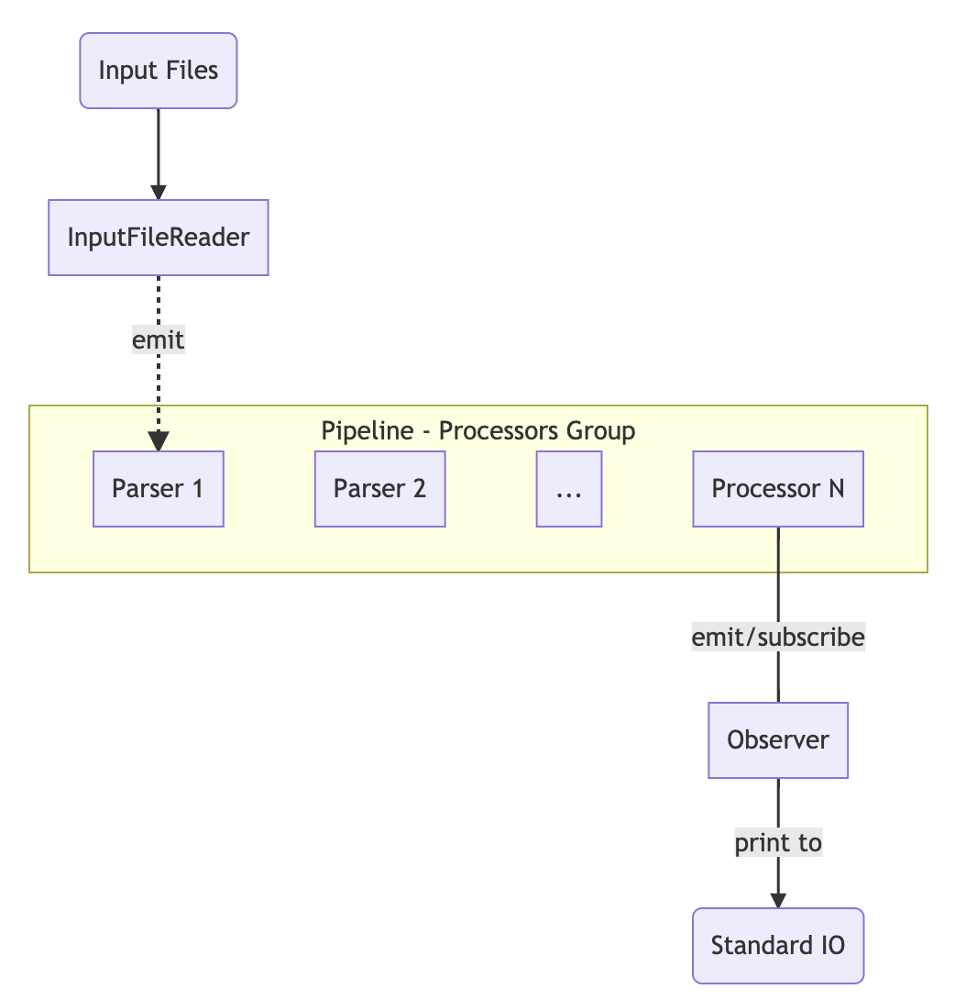

# Horses list generator - A Kotlin command-line project example

[](https://circleci.com/gh/patrickyin/beteasy-challenge-backend)

## Summary
This is a command-line based Horses list generator built with Kotlin. It also contains Unit Test built with JUnit and Integration Test built with Cucumber Aruba.

#### Tech stack
- Language: [Kotlin](https://kotlinlang.org/)
- DI Framework: [Dagger 2](https://google.github.io/dagger/)
- Reactive programming framework: [ReactiveX](http://reactivex.io/)
- Json serialization/deserialization: [Kotlin serialization](https://github.com/Kotlin/kotlinx.serialization)
- XML parsing: [dom4j](https://dom4j.github.io/)
- Unit test framework: [JUnit 4](https://junit.org/junit4/)
- Mocking: [MockK](https://github.com/mockk/mockk)
- Assertions: [AssertJ](http://joel-costigliola.github.io/assertj/)
- Integration test framework: [Cucumber-Aruba](https://github.com/cucumber/aruba/)
- Build system: [Gradle](https://gradle.org/)
- Continuous integration and delivery platform: CircleCI[](https://circleci.com/gh/patrickyin/beteasy-challenge-backend)

#### Implementation clarification
- Access property directly rather than through getter?
  It is always pass through getter when access property directly since Kotlin generates getter and setter for every properties at compiler level.
- Some code compares two objects's memory address(like Java) by using `==` or `equles`? No, for Kotlin data class, it compares its value rather than object memory address.

#### Application data flow


## Requirement
- JDK 8
- Bash (location: /bin/bash)

## Usage
*(Tested on macOS 10.14.6)*

#### Run unit tests
```console
$ ./gradlew test
```

#### Run integration test
```console
$ # Please install bundler first
$ sudo gem install bundler

$ bundle install

$ # Run test
$ # Cucumber feature file(test data) is located in ./features
$ bundle exec cucumber
```

#### Run application
```console
# The input file path can be passed through command line arguments. 
$ ./run.sh data/Wolferhampton_Race1.json data/Caulfield_Race1.xml
```

## FAQ
- Q: There is an error message `Error:(40, 17) java: cannot find symbol` comes up when I build the project in IntelliJ IDEA. How should I fix it?
- A: It can be fixed by enabling `Delegate IDE build/run actions to gradle` in your IDE. Open IntelliJ IDEA's `Preferences` -> `Build, Execution, Deployment` -> `Build Tools` -> `Gradle` -> `Runner` -> Check the checkbox `Delegate IDE build/run actions to gradle`


## What's next?
To save time, I just setup a simple CI pipeline which compiles the project and runs unit tests on Docker OpenJDK environment.

So next step, I need to add one more build step about running the integration test on CI. To achieve that, the Ruby runtime which Cucumber Aruba needs has to be added to CircleCI official OpenJDK Docker image. That means we have to build a customized Docker image and use it to run the build.

## License
```
MIT License

Copyright (c) 2019 Patrick Yin

Permission is hereby granted, free of charge, to any person obtaining a copy
of this software and associated documentation files (the "Software"), to deal
in the Software without restriction, including without limitation the rights
to use, copy, modify, merge, publish, distribute, sublicense, and/or sell
copies of the Software, and to permit persons to whom the Software is
furnished to do so, subject to the following conditions:

The above copyright notice and this permission notice shall be included in all
copies or substantial portions of the Software.

THE SOFTWARE IS PROVIDED "AS IS", WITHOUT WARRANTY OF ANY KIND, EXPRESS OR
IMPLIED, INCLUDING BUT NOT LIMITED TO THE WARRANTIES OF MERCHANTABILITY,
FITNESS FOR A PARTICULAR PURPOSE AND NONINFRINGEMENT. IN NO EVENT SHALL THE
AUTHORS OR COPYRIGHT HOLDERS BE LIABLE FOR ANY CLAIM, DAMAGES OR OTHER
LIABILITY, WHETHER IN AN ACTION OF CONTRACT, TORT OR OTHERWISE, ARISING FROM,
OUT OF OR IN CONNECTION WITH THE SOFTWARE OR THE USE OR OTHER DEALINGS IN THE
SOFTWARE.
```
